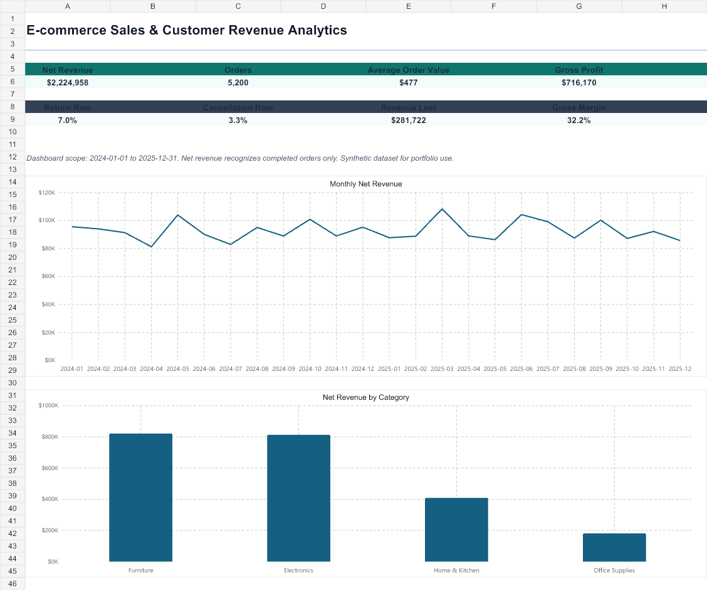

# E-commerce Sales & Customer Revenue Analytics

An end-to-end SQL and Power BI portfolio case study designed for Data Analyst, Reporting Analyst, and BI Analyst roles. The project analyzes revenue, contribution profit, targets, customer retention, delivery performance, and losses from returns and cancellations across two years of synthetic e-commerce activity.



## Business problem

Commercial and operations leaders need one reporting model that explains whether growth is profitable, which regions and products require action, how customer behavior changes over time, and where operational problems remove booked revenue.

The analysis answers:

1. Which categories and products drive revenue and contribution profit?
2. Which regions are growing, declining, or missing target?
3. How are revenue, AOV, and margin changing month over month?
4. Which customers are Champions, Loyal, At Risk, or Hibernating?
5. What is customer repeat-purchase and cohort retention performance?
6. Which return, cancellation, and delivery problems create the most loss?
7. Are discounts creating profitable sales?

## Dataset and model

The deterministic synthetic dataset contains:

- 5,200 orders and 9,139 order lines
- 720 customers and 48 products
- eight sales territories grouped into four regions
- January 2024 through December 2025 activity
- monthly revenue and contribution-profit targets
- acquisition channel, campaign, brand, promised delivery, actual delivery, shipping cost, return reason, cancellation reason, and stock-out fields

```text
Date ──< Orders >── Customers ── Customer RFM
          │  └───── Regions ──< Targets
          │
          └──< Order Items >── Products

Customer first purchase ── Cohort Retention
```

## Results

- Net Revenue: **$2.225M**
- Gross Profit: **$716.2K**
- Contribution Profit: **$631.6K**
- Completed-order AOV: **$476.74**
- Revenue Attainment: **96.1%**
- Contribution-Profit Attainment: **80.2%**
- Return Rate: **7.0%**
- Cancellation Rate: **3.3%**
- Lost Revenue: **$281.7K**

Detailed findings and recommendations are documented in [`docs/business_insights.md`](docs/business_insights.md).

## Repository structure

```text
data/raw/                       Star-schema CSV source tables and targets
data/processed/sales_fact.csv   Denormalized analytical extract
data/processed/customer_rfm.csv
data/processed/cohort_retention.csv
data/ecommerce_analytics.sqlite Runnable SQLite database
sql/01_schema.sql               Tables, indexes, and analytical view
sql/02_data_quality.sql
sql/03_kpi_analysis.sql
sql/04_customer_analysis.sql
sql/05_product_analysis.sql
sql/06_regional_target_analysis.sql
sql/07_cohort_delivery_analysis.sql
powerbi/measures.dax            Reusable DAX measures
powerbi/theme.json              Dashboard theme
powerbi/dashboard_build_guide.md
docs/data_dictionary.md
docs/business_insights.md
outputs/ecommerce_sales_analytics.xlsx
scripts/                        Reproducible dataset and database builds
```

## KPI policy

- Net Revenue recognizes completed orders only.
- Lost Revenue is booked revenue removed by returns or cancellations.
- AOV divides Net Revenue by completed orders.
- Contribution Profit subtracts COGS, allocated shipping, return processing, and cancellation processing from recognized revenue.
- Revenue and contribution targets are synthetic business assumptions and are identified as such.

Definitions are maintained consistently across SQL, DAX, the processed extracts, and the Excel QA workbook.

## Reproduce the project

1. Run `node scripts/build_project.mjs`.
2. Run `python scripts/build_database.py`.
3. Open `data/ecommerce_analytics.sqlite` and execute the scripts in `sql` in numeric order.
4. Review `outputs/data_quality_checks.json`; all issue counts should be zero.
5. Import the six raw CSV tables and two processed customer-analysis tables into Power BI Desktop.
6. Follow `powerbi/dashboard_build_guide.md` and add the measures from `powerbi/measures.dax`.
7. Reconcile Power BI Net Revenue and Contribution Profit to the SQL and Excel totals before publishing.

## Skills demonstrated

- Star-schema and semantic-model design
- SQL joins, CTEs, conditional aggregation, window functions, RFM scoring, cohorts, targets, and rolling trends
- DAX measures, time intelligence, profitability, and target variance
- Customer segmentation and retention analysis
- Operational analysis of returns, cancellations, stock-outs, and late delivery
- Data-quality testing and cross-tool reconciliation
- Translating quantitative findings into recommendations for commercial, operations, CRM, and BI stakeholders

## Resume bullet

Built a reproducible e-commerce analytics solution across 5,200 orders using SQL, Power BI-ready DAX, and a star schema; developed revenue and contribution-profit KPIs, target variance, RFM segmentation, cohort retention, delivery-risk analysis, and automated data-quality reconciliation.

## Limitation

The data is synthetic and designed for analytical practice. Conclusions demonstrate the workflow and decision framework rather than representing an actual company.

